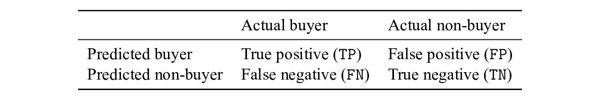
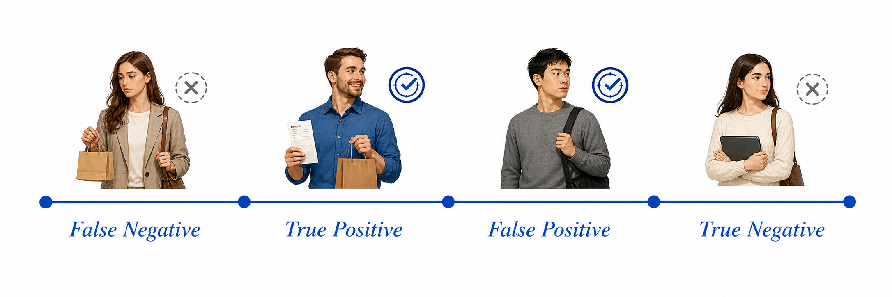
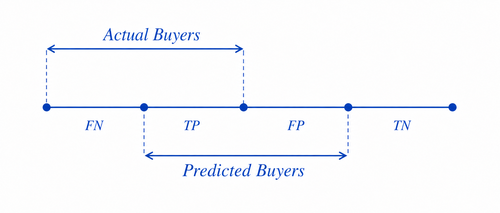
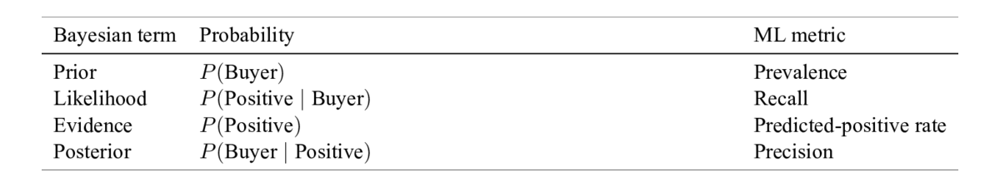

# Bayes' Theorem Is Already Inside the Confusion Matrix

## A Model That Finds Half of the Buyers

You work in sales. For a particular product, only 10% of marketing leads eventually buy it. Calling every lead is expensive, so the ML team builds a model that predicts which leads are likely to buy.

A colleague gives you one result:

> The model identifies 50% of the leads who actually buy.

Should you use the model?

The number sounds disappointing. The model misses half of the buyers. But it is not enough to decide whether the model is useful. If its positive predictions reduce a list of 10,000 leads to 1,000 strong candidates, it may be extremely valuable. If it marks 9,000 leads as positive, it has saved the sales team almost no work.

We know how common buyers are, and we know how often the model finds them. We still do not know how often a positive prediction is correct.

This is the same problem as Bayes' theorem.

## The Probability We Have Is Not the Probability We Need

In the previous article, we considered a forest where 10% of mushrooms were poisonous and half of all poisonous mushrooms had red caps. That information did not tell us the probability that a red-capped mushroom was poisonous.

The direction of the condition mattered:

The ML question has exactly the same structure. Let `Buyer` mean that a lead eventually buys, and let `Positive` mean that the model predicts that the lead will buy.

The colleague gave us:

This is recall: among all actual buyers, what fraction did the model identify?

The sales team needs the reverse probability:

This is precision: among all leads predicted to be buyers, what fraction actually buy?

Recall and precision look at the same successful predictions, but divide them by different groups. Bayes' theorem connects them.

## Two Models With the Same Recall

Suppose we have 1,000 leads. Because the prevalence of buyers is 10%, 100 of them will buy. A recall of 50% means that the model correctly identifies 50 buyers.

Now consider two possible models.

The first model produces 100 positive predictions. Of these, 50 are buyers and 50 are non-buyers. Its precision is 50%.

The second model produces 500 positive predictions. It still identifies the same 50 buyers, so its recall is also 50%. But now 450 positive predictions are non-buyers. Its precision is only 10%.

Both models have the same prevalence and the same recall. They are not equally useful to a sales team. The missing quantity is how often the model predicts the positive class at all.

This is the ML version of asking how common red caps are among all mushrooms. A sign is useful only relative to how common that sign is overall.

## From the Confusion Matrix to Bayes' Theorem

A binary classifier divides all cases into four groups:

Let the total number of leads be:

The fraction of all leads who are buyers is the prevalence:

The fraction of buyers identified by the model is recall:

The fraction of all leads that receive a positive prediction is the predicted-positive rate:

The fraction of positive predictions that are correct is precision:

These are not four unrelated formulas. They describe different ratios of the same groups.

## A Geometrical Proof

As in the mushroom example, imagine placing every lead on one line in this order:

1. false negatives
2. true positives
3. false positives
4. true negatives

The complete segment contains all leads. The first two parts contain all actual buyers. The middle two parts contain all positive predictions. Their overlap is the true-positive segment.

Recall compares that overlap with all actual buyers:

Precision compares the same overlap with all positive predictions:

Now divide recall by precision:

Express both segment lengths as fractions of all leads:

Rearranging gives:

Written as conditional probabilities, this is Bayes' theorem:

Nothing new had to be added to the confusion matrix. Bayes' theorem was already present in the definitions of recall, precision, prevalence, and the predicted-positive rate.

## The Model Is Additional Knowledge

The similarity between the two articles is not a coincidence. Bayes' theorem is not specifically about mushrooms, medical tests, or machine learning. It describes how evidence changes the probability of a hypothesis.

In the forest, the hypothesis was that a mushroom was poisonous, and the evidence was a red cap. In sales, the hypothesis is that a lead will buy, and the evidence is a positive prediction from a trained model.

The model may be mathematically complicated, but Bayes' theorem does not care how the evidence was produced. Once the prediction exists, it is another observed sign. We ask how often that sign appears among buyers, how common buyers are, and how often the sign appears overall.

This gives the correspondence:

The vocabulary changes, but the relation does not.

## What the Formula Does Not Decide

High precision does not automatically make a model useful, and low precision does not automatically make it useless. A sales team may accept many false positives when contacting a lead is cheap and missing a buyer is expensive. In another business, each contact may require hours of specialist work, making false positives costly.

The classification threshold also changes recall and precision together. Raising the threshold usually produces fewer positive predictions and higher precision, but it may miss more buyers. Lowering it usually finds more buyers while sending more weak leads to the sales team.

Bayes' theorem explains how the metrics are related. It does not choose the business trade-off. That decision requires the costs of false positives, false negatives, and sales effort.

## How to Read a Model Result

When someone reports recall, do not treat it as a complete evaluation. Ask three questions:

1. What is the prevalence of the positive class?
2. What fraction of all cases does the model predict as positive?
3. What precision follows at the threshold we plan to use?

More generally, check the direction of every conditional probability. “How often does the model flag a buyer?” and “How often is a flagged lead a buyer?” are different questions. The first describes the model's behavior among buyers. The second describes what the sales team will experience when using its predictions.

The practical value of Bayes' theorem begins with noticing that reversal.

## The Same Geometry, With Different Names

In the first article, Bayes' theorem connected poisonous mushrooms, red caps, and the overlap between them. Here it connects actual buyers, positive predictions, and true positives. In both cases, the proof comes from comparing the same overlap with two different groups.

That is why Bayes' theorem appears so often. New evidence does not remove uncertainty. It reorganizes a population into groups and asks us to use the correct denominator.

A confusion matrix is one of those reorganized populations. Recall, precision, and prevalence are not merely entries in a model report. They are Bayes' theorem expressed in the language of machine learning.
