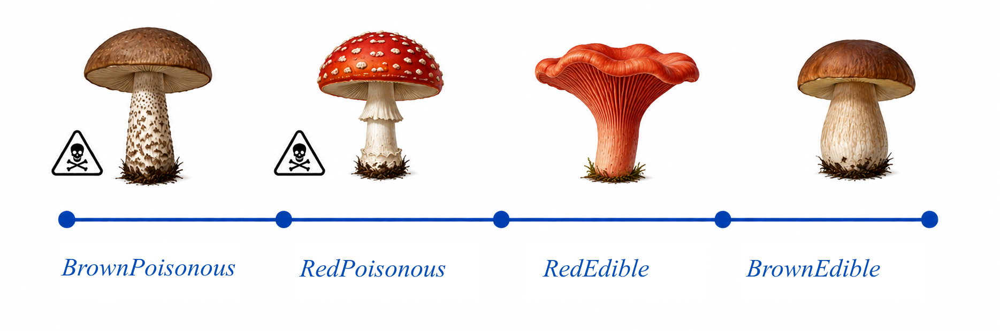
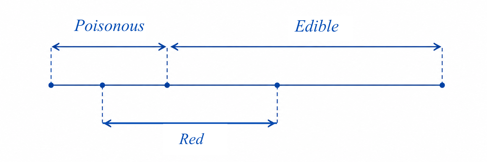

# Bayes' Theorem with Mushrooms and a Geometrical Proof

## Motivation
I decided to write this article because I have read many explanations and proofs of Bayes' theorem, but most of them felt more complex than the theorem itself. I wanted an explanation with a geometrical example and proof: first make the practical question clear, then show the formula as a relation between segment lengths. Such a powerful theorem should be illustrated as clearly as the pigeonhole principle.

## Illustration with Mushrooms
You are gathering mushrooms. You know that 10% of all mushrooms in the forest are poisonous. You pick up the next mushroom, and your friend tells you:

> Throw it away. It has a red cap. Half of all poisonous mushrooms have red caps.

Should you throw away this mushroom or keep it?

At first, this sounds like enough information. Red caps are common among poisonous mushrooms, so a red cap feels dangerous. But the question cannot be answered yet. We also need to know how common red caps are among all mushrooms, or equivalently how common they are among edible mushrooms.

This is the central point of Bayes' theorem: the probability we are given is not always the probability we need.

## The Missing Question

Your friend tells you how often poisonous mushrooms have red caps. But the practical question goes in the opposite direction: when you see a red cap, how likely is this mushroom to be poisonous?

These are not the same question. Confusing them is the trap.

To see why, imagine two extreme forests.

In the first forest, no edible mushrooms have red caps. Then every red-capped mushroom is poisonous, and you should throw away every red-capped mushroom.

In the second forest, all edible mushrooms have red caps. In this case, taking only red-capped mushrooms can lower the probability of poison, because it removes the brown mushrooms, which in this forest can only be poisonous. Here, you should throw away everything except the red-capped mushrooms.

The same statement can be true in both forests: half of all poisonous mushrooms have red caps.

But the decision can be completely different. The missing information is not about poisonous mushrooms alone. It is about how red caps are distributed in the whole forest.

## The Three Quantities We Need

The two forests show what is missing. To answer the practical question, we need three statements:

- how many mushrooms in the forest are poisonous
- how many poisonous mushrooms are red-capped
- how many mushrooms overall are red-capped

In Bayesian language, these are:

- prior knowledge: how common poisonous mushrooms are
- likelihood: how common red caps are among poisonous mushrooms
- evidence: how common red caps are overall

The result we want is:

- posterior knowledge: how likely a red-capped mushroom is to be poisonous

The evidence term can be forgotten. Without it, we do not know whether a red cap is rare and suspicious, common and weakly informative, or even evidence in favor of keeping the mushroom.

## A Geometrical Illustration

Let's now create an illustration. Sort all mushrooms in the forest and place them in one line.

For simplicity, assume there are only two cap colors: red and brown. Brown means "not red." This does not change the logic. It only makes the picture easier to read.

Place all mushrooms from left to right:

1. brown poisonous mushrooms
2. red-capped poisonous mushrooms
3. red-capped edible mushrooms
4. brown edible mushrooms



This gives us three important points inside the segment:

- the point between brown poisonous and red-capped poisonous mushrooms
- the point between red-capped poisonous and red-capped edible mushrooms
- the point between red-capped edible and brown edible mushrooms



These points create the subsegments we need. The whole segment is all mushrooms. One larger part is poisonous mushrooms. Another larger part is red-capped mushrooms. Their overlap is red-capped poisonous mushrooms. This overlap is the bridge between the probability your friend gave you and the probability you actually need.

Bayes' theorem is about comparing these subsegments in the right way.

## Turning the Picture Into Probabilities

Let the counts be:

- `Poisonous`: all poisonous mushrooms
- `Edible`: all edible mushrooms
- `Red`: all red-capped mushrooms
- `BrownPoisonous`: brown poisonous mushrooms
- `RedPoisonous`: red-capped poisonous mushrooms
- `RedEdible`: red-capped edible mushrooms
- `BrownEdible`: brown edible mushrooms

With these names, the basic probabilities are just ratios of segment lengths.

By definition, the probability of a poisonous mushroom is:

```text
P(Poisonous) = Poisonous / (Poisonous + Edible)
```

The probability of a red-capped mushroom is:

```text
P(Red) = Red / (Poisonous + Edible)
```

The probability your friend gave you is the probability that a poisonous mushroom has a red cap:

```text
P(Red|Poisonous) = RedPoisonous / Poisonous
```

Here `P(Red|Poisonous)` is short for `P(Red|Poisonous = true)`.

The probability we need uses the same overlap, but divides it by a different total:

```text
P(Poisonous|Red) = RedPoisonous / Red
```

This is the question from the forest: if I see a red cap, what is the probability that the mushroom is poisonous? The numerator is the same as in `P(Red|Poisonous)`, but the denominator has changed.

## The Proof

```text
P(Red|Poisonous) / P(Poisonous|Red) = (RedPoisonous / Poisonous) / (RedPoisonous / Red)
= (1 / Poisonous) / (1 / Red) = Red / Poisonous = P(Red) / P(Poisonous)
```

This gives us:

```text
P(Red|Poisonous) / P(Poisonous|Red) = P(Red) / P(Poisonous)
```

Or, in the more famous form:

```text
P(Poisonous|Red) = P(Red|Poisonous) * P(Poisonous) / P(Red)
```

## The Classical Bayesian Situation

This gives the classical Bayesian situation:

- prior `P(Poisonous)`: how many mushrooms in the forest are poisonous
- likelihood `P(Red|Poisonous)`: how many poisonous mushrooms are red-capped
- evidence `P(Red)`: how many mushrooms overall are red-capped
- posterior `P(Poisonous|Red)`: whether a red-capped mushroom is likely to be poisonous

The formula turns the probability we know into the probability we need by accounting for how common the observed sign is overall.

## Why This Feels Like a Tautology

In this geometrical form, Bayes' theorem almost sounds like a tautology. We compare ratios of the same subsegments and show that the algebra balances.

That is the interesting part. The power of Bayes' theorem is not hidden in complex algebra. The algebra is simple. The power is in the interpretation: deciding what the segment is, what the subsegments mean, what evidence we observed, and what question we are actually trying to answer.

In the next article, I am going to show how the same illustration can be used to interpret ML model results. The same theorem, the same geometrical relation, but different meanings.
