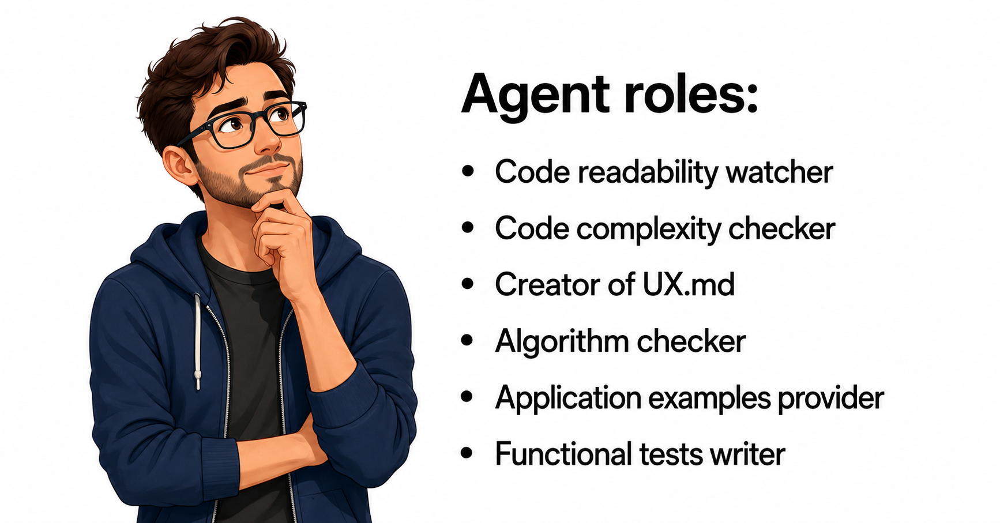

# If the Human Is One of the Agents

What roles does a software developer play in AI-assisted projects, and can we give these roles to AI too?

## The problem

As I showed in my previous research, it can take several hundred prompts to create a relatively simple product. But this does not mean that all these prompts should be created by a human. If the work can be described as a sequence of decisions, checks, corrections, and requests, then the next question is natural: what should an agent do to substitute for the developer? Can we give it a set of instructions and limitations to simulate the developer and product owner?

The idea of AI writing prompts to AI is not new. It is a core idea of agentic systems. One AI agent does not have to do the whole job directly. It can ask another agent to inspect code, write tests, review a plan, search for bugs, or compare the current result with a product specification. The communication channel between these agents is usually text. One agent writes a prompt. Another agent reads it, performs a task, and returns an answer. Then the first agent decides what to do next.

This is close to how people already work with LLMs. A human writes a prompt, receives an answer, evaluates it, and writes the next prompt. In a more agentic system, part of this loop is moved from the human to another AI. The AI can take different roles and help other agents through a text interface. If all agents are LLMs, we have a fully autonomous system.

But AI-assisted development is not usually fully autonomous. In many real projects, the human is still one of the agents. The human reads the result, notices that the code is too complex, asks for refactoring, decides that the behavior does not match the product idea, gives examples, and asks for tests. This is still agentic work, but one important agent is human.

So the question is: which roles does the human play in this system, and which of these roles can be given to AI? In my experiment with a game, I was one of the agents. So it was not an autonomous system. Can we change it, and how?

In this article I am going to reflect on my contribution to the development process, treating myself as one of the agents. This may help to build AI that can do this part of the job.

## Self-reflection

I found that my main roles were to check that:

- The code should be readable by a human.
- Code complexity should not be too high. Classes should be introduced where needed.
- The product should use proper algorithms and data structures. For example, use a hash table for search and an array list for retrieval by index, and not vice versa.
- Functional tests should cover functionality.

Some of these roles are close to traditional software engineering. Some are closer to product ownership. This distinction matters, because not every role can be automated in the same way.

## The roles

My work as a "human agent" can be split into these roles:

- Code readability watcher
- Code complexity checker and refactorer
- Creator of `UX.md`
- Algorithm checker based on `UX.md`
- Application states and user behavior examples provider
- Functional tests writer

## Code Readability Watcher

This possibly can be done by AI, if we formalize what good code is. There are many general recommendations and code styles for different languages. Mature development studios have their own coding styles. So it can be explained to AI.

The role is not mysterious. The agent should check whether the code is understandable for a human developer. Are names clear? Are functions too long? Is the same idea repeated in several places? Is important logic hidden in a large conditional block? Does the code follow the style of the project?

This kind of role can be described in `AGENTS.md` or another project instruction file. It does not require the agent to understand the product deeply. It requires it to understand the codebase and a definition of readable code. Because of that, this is one of the easiest human roles to delegate to AI.

## Code Complexity Checker and Refactorer

This role does not just check, but actively changes the code. Not by itself, but by prompting. In my own work, I often acted as the person who saw that the code was becoming too complicated and asked the programming agent to refactor.

The formal rules and heuristics of how to write good code with low complexity should be placed in `AGENTS.md` from the beginning. But maybe it is overkill to use all of them with each prompt. So the most important rules should be in `AGENTS.md`, and some rules should be checked regularly by this role, for example before pushing to the repository.

This role should ask questions such as: is this function doing too many things? Should this behavior be a separate class? Is there a simpler data structure? Is the current design good enough for the next feature, or will it break under small changes?

This can be done by AI, but with more care than readability checking. Refactoring changes the shape of the code. A bad refactor can make the program worse while still passing tests. So this role needs tests, examples, and a clear instruction to preserve behavior.

## Creator of `UX.md`

This is where the programming happens now.

It can't be done by AI, because it is about the product, not code. The product owner should create this specification. Maybe with help of AI. Maybe as a result of an AI interview with the final user. But I don't see how this part can be done solely by AI if AI is not the final user.

`UX.md` is not only a design document. In this kind of AI-assisted development, it becomes a programming layer above the code. It says what the application is supposed to do from the user's point of view. It describes expected behavior, screens, states, actions, and constraints. The coding agent can then use it as a source of truth.

Without this document, the AI has to infer the product from scattered prompts. That works for a demo, but it becomes weak when the project grows. The AI may implement something that is technically correct but wrong for the actual user experience. The product owner knows what "good" means in the product. AI can help write this down, but it cannot invent the real product intent by itself.

## Algorithm Checker Based on `UX.md`

This certainly can be done by AI. With the current level of abstraction, it treats prompts as a mix of code instructions and business logic. This work can be done by AI. It can be either a code scan using `UX.md` or a request to the main programming AI agent to check that the solution is good for a particular UX.

For example, if `UX.md` says that the user often searches by name, then the implementation should not use a slow linear scan where a hash table or index is more appropriate. If `UX.md` says that the user frequently retrieves items by position, then an array-like structure may be better. The right algorithm depends on the expected behavior, not only on the code.

This role is important because AI-generated code can look reasonable while using the wrong structure. The program works on a small example, but it becomes slow or awkward in real use. A separate algorithm-checking agent can compare the implementation with `UX.md` and ask: does the code fit the actual usage pattern?

## Application States and User Behavior Examples Provider

This is another example of the abstraction of new programming. AI can't create examples of the application state without a human. They are part of business logic and should be provided by the product owner.

Again, maybe this can be done with help from AI. For example: record the current state of the application, record my activity, record the final state. AI can help transform this into examples, fixtures, or test cases. But I don't see how a fully autonomous system can create them by itself, except if AI is the final user.

These examples are important because they turn vague product expectations into concrete checks. Initial state, action, final state: this is a very strong format. It can be used for functional tests, regression tests, and review by another agent. It also gives the coding agent less room to invent the behavior.

## Functional Tests Writer

This certainly can be done by AI if examples are provided.

The human does not need to write every test manually. If `UX.md` exists and there are examples of application states and user behavior, AI can turn them into functional tests. The hard part is not always writing test code. The hard part is knowing what must be tested.

This is why the role depends on the previous one. Without examples, AI may test the implementation instead of the product. It may confirm that the current code does what it already does, rather than checking whether the code does what the user needs. With examples, the functional tests become much more useful.

## What Can Be Automated

As I see it, some roles can be done by AI with no big problem. Code readability checking, code complexity review, algorithm checking, and functional test writing are all good candidates. They need clear rules, access to the code, and a stable product description.

But "Creator of `UX.md`" and "Application states and user behavior examples provider" can't be done by AI without a human. They are the new abstraction layer where programming occurs. They can be facilitated by AI, but I don't see how they can be fully automated.

This is the central point. In AI-assisted development, the human may write less code, but the human does not disappear. The human moves upward. The human defines product intent, gives examples, decides what matters, and checks whether the result is useful.

If we want more autonomous AI development, we should not only ask how to make the coding agent stronger. We should ask which human roles are still inside the loop, describe them explicitly, and decide which of them can become separate agents.

The future autonomous system may not be one big AI developer. It may be a group of agents: one writes code, one checks readability, one checks complexity, one compares the result with `UX.md`, one writes tests, and one verifies behavior against examples. But unless the system also has a real source of product intent, it is still missing the role that the human currently plays.
