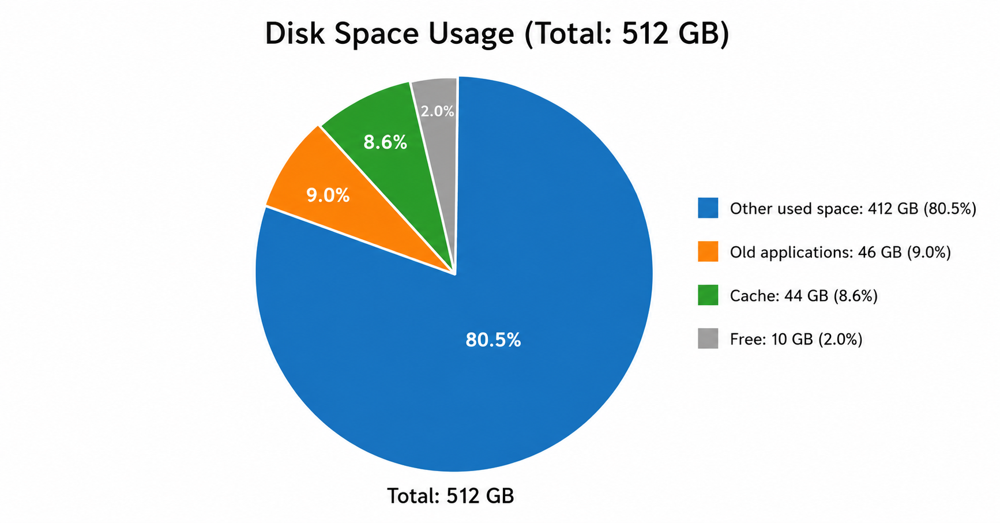

# When AI Does Virtual Chores for You

*In my case, it freed 90GB of disk space.*

## The problem

I found that my two-year-old MacBook had almost no free disk space left. I knew I had not downloaded or stored many additional files. A year ago, the same computer gave me the same practical value, but used less disk space. Now it did not.

I am sure you know this situation, regardless of whether you use a Mac or a PC. After several years, a computer works worse than it did after purchase. Not necessarily because it is old. Let's call it dirty. Applications leave caches. Developer tools keep old dependencies. Package managers remember old versions. Containers and virtual machines store data that is not visible in normal file browsing. The computer still works, but it carries a lot of hidden history.

There are applications that can help improve the situation, but the reasons for "worse" depend on how the computer was used. I don't know a good universal solution. My machine is not only a personal computer. It is also a development environment, a test bench, a place for experiments, and a storage of old technical decisions. A generic cleaner can remove browser cache, but it cannot always explain why Docker uses 16GB when images take only 2GB.

## My solution

So I tried a different approach: use an LLM as a system maintenance assistant. In this article, I use "LLM" for ChatGPT/Codex-style language models, and "AI" for the broader practice of AI-assisted work.

Windows, macOS, and Linux all have terminals. They can execute commands and scripts. Scripts are text, and LLMs are very good with text. So I asked an LLM to write scripts that check the health of my computer, especially disk usage, and then explain the results.

Even if you have never run scripts in the terminal, this activity does not require too much from you. You formulate a request, run scripts, collect logs, and show them to your AI. It can write scripts, read outputs, and explain what happened. It can also correct itself and improve the scripts. You just need to formulate what to do and be careful about what you allow it to change.

## My setup

- macOS 14.4.1
- VS Code as the development environment, basically a text editor in this experiment
- Codex, OpenAI's coding agent plugin for VS Code
- ChatGPT Plus, which makes Codex more powerful

Codex integrates ChatGPT into VS Code, so it can see project files and run some commands on the computer. You can try a similar experiment with other LLMs if they are powerful enough and can be integrated into a code editor or terminal. Technically, you can also do this without an IDE. There is a version of Codex for the command line. But for me, it is more convenient in an IDE.

## The process

The first important decision was to treat this as a project, not as a random chat.

As in my other experiments with AI-assisted development, I started with a new empty project. I explained the purpose of the project to Codex and asked it to create README.md and AGENTS.md files. The README was for me. AGENTS was for Codex itself, to record important information about the project: read-only diagnostics first, dry-run cleanup by default, explicit approval before destructive actions.

Both files are text, and it is generally a good idea to read them after creation to see how AI understands you. This was the starting point. It turned one maintenance session into a small reproducible workflow.

Next, I asked for a script that performs a health check of my operating system. The first version was read-only. It collected OS information, disk usage, memory pressure, load, Homebrew state, security posture, large directories, large caches, recent diagnostic reports, and other signals. The script wrote text and JSON reports.

You can run this kind of script yourself or ask AI to run it. The second option is easier, but some commands are forbidden from the VS Code terminal or from the agent sandbox. To run a serious check or fix, you may need to open the terminal yourself. It is not difficult. AI can explain how to do it, step by step, like a professional system administrator.

This became the core process:

1. Ask AI to write a read-only diagnostic script.
2. Run the script and collect the report.
3. Show the report to AI.
4. Ask it to identify concrete problems.
5. For every fix, ask first for a dry-run (read-only) script.
6. Read the proposed actions and logs.
7. Only then run the real fix.

This last points matters. For every action that does not just scan but also changes something, it is important to ask for a script that imitates the action and writes logs without actually changing anything. AI writes the script, you run it in read-only mode, you show the logs to AI, it confirms that everything looks OK, and only then do you run the full script.

The first health scan did not say, "Your disk is full because of one obvious thing." It gave a more useful answer: the system was generally healthy, but there were several local problems. Some were about disk usage. Some were about developer tools. Some were about old dependencies. This is exactly the kind of problem where an LLM is useful, because the work is not one magic command. It is a sequence of small investigations.

## Here are examples of what we found and how we fixed it

The first serious issue was Homebrew. The deep scan showed outdated packages, missing dependencies, and deprecated components. The command `brew missing` showed that `gtksourceview4`, `pspp`, and `spread-sheet-widget` were missing the correct ICU dependency. We upgraded `icu4c@78`, reinstalled the affected formulae, and verified that `brew missing` became clean. This was not mainly about freeing disk space. It was about restoring package-manager health before doing more cleanup.

The second issue was Whisky. Whisky was deprecated in Homebrew, and one of its bottles contained a Steam directory using more than 5GB. I did not need it. We uninstalled the Whisky cask and removed its bottle data. After that, the Homebrew warning disappeared and the large bottle directory was gone.

The third issue was Apple's Command Line Tools. Homebrew reported problems with them, and checks showed that `xcode-select` and `xcrun` could not find the active developer tools. This is the kind of broken state that can quietly damage future development work. We reset the Command Line Tools installation, ran the macOS installer, and verified that `xcode-select -p` and `xcrun --find clang` worked again.

The fourth issue was Docker storage. Docker itself looked small at first: only two images, about 2GB total. But `docker system df` showed the real problem. The build cache used almost 12GB. That explained why Docker Desktop used much more disk space than the visible images suggested. This is a good example of why simple folder browsing is not enough. The visible object is not always the expensive object.

The fifth issue was Anaconda. It used about 15GB and was first in the shell path for `python`, `pip`, and Jupyter commands. That meant Python commands were controlled by Anaconda even when I expected Homebrew Python. We created a guarded cleanup script that removed Anaconda, cleaned its shell startup lines, and switched active Python and `pip3` back to Homebrew Python.

There were also other findings: large browser caches, Homebrew downloads, pip cache, Playwright cache, Gradle cache, Colima state, Ollama models, and security settings such as FileVault and firewall state. Not everything should be deleted. For example, Ollama models are not cache in the same sense as browser cache. They are downloaded assets. Colima is virtual-machine and container state. Deleting it can remove useful local images and volumes. The useful part of the AI workflow was not that it said "delete everything." The useful part was that it classified things and explained the consequence of each choice.

## The result

After the health scan and several cleanup passes, we cleaned about 90GB of disk space from unusable old applications, old application versions, caches, and developer-tool leftovers. The whole maintenance process took about three hours. I am very glad about the result.

The practical lesson is not that AI should control your computer. It should not. The practical lesson is that AI is very good at turning a vague maintenance problem into a sequence of inspectable scripts and decisions.

This is slower than pressing one "clean" button. But it is safer and more educational. You learn what is actually on your machine. You see which data is disposable, which data is state, and which data belongs to tools you still use. You also get a record of what happened.

An LLM cannot replace judgment here. But it can make the investigation much cheaper. It can read logs, write small scripts, explain unfamiliar tools, and remember the safety rules inside the project. That is enough to turn computer maintenance from a vague unpleasant chore into a controlled technical process.
